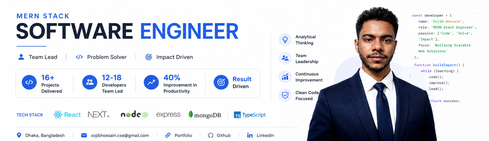

<!--- banner --->

 

<!--- title --->

  <ul align="center">
    
<h1 style="display: inline-block">Hi 👋, I'm MD SOJIB HOSSAIN</h1>

    <!--- typo --->
    
  </ul>

 

<!--- about --->
- 👋 Hi, I’m **[@Md Sojib Hossain](https://github.com/Md-Sojib-Hossain-cse)**
- 🖥️ I’m currently working on **React.js, Next.js, Typescript and Redux** for frontend development.
- 🗄️ Using **Node.js, Express.js, MongoDB, Mongoose, PostgreSQL, and Prisma** for the backend.
- 🛠️ I’m currently learning **Docker and AWS**.
- 💬 Ask me about **Full-Stack (React, Next, Node, Express , MongoDB, Prisma, PostgreSQL)**.
- 🌐 Explore My Portfolio **[MD SOJIB HOSSAIN](https://project-tau-three-92.vercel.app)** and My **[Resume](https://drive.google.com/file/d/1ZuACwgAvcu2D6ZcylnF4QHEM073Pfp_U/view?usp=sharing)**
- 📝 Connect me on Linkedin **[LinkedIn](https://www.linkedin.com/in/mdsojibhossaincse)**
- 📫 Feel free to reach me out **[Email](sojibhossain.cse@gmail.com)**
  
 

<!--- socials --->
## <b> FOLLOW ME ON SOCIALS:</b>

  

    
    <!-- 
    
     -->
  

 

<!--- technology --->
##  <b> TECHNOLOGY STACK:</b>

### Languages:

### CSS Frameworks & Libraries:

### JavaScript Frameworks & Libraries:

### Database & Model:

### Deployment Platform:

### Design & Graphics:

### Tools & Technologies:

 

<!--- statistics --->
## <b> GITHUB STATISTICS & ANALYSIS:</b>

## 📈 Contribution Graph

### GitHub Statistics:
|  |  |
| ------------- | ------------- |

### Repository Stats & Streak:
|  |  |
| ------------- | ------------- |

 

<!--- random quote --->
##  <b> RANDOM DEV QUOTE:</b>

---

<!--- visit count --->

  

## 📊 GitHub Statistics

  

  

## 🔥 Repository Stats & Streak

  

## 🏆 GitHub Trophy

## 👀 Profile Views

### **I'm MD Sojib Hossain** ([22](https://github.com/moepoi/moepoi/commit/c15e0dc41a58149d47f7813f145259151a2a73c7) y.o) 😎

Aspiring full-stack web developer (MERN) | Passionate about clean code, performance & UI. :rocket:

💼 I am a MERN Stack developer. I build web applications using React, Node.js, Express.js, and MongoDB, focusing on both frontend and backend development. I'm also passionate about creating responsive layouts, clean UI designs, and performance-focused coding.

:page_with_curl: I'm currently working with:
  

:trophy: Github Stats

Feel free to contact me :yum:
  

---
### 📌 My Projects
- Meal Shop 🍽️ – A food ordering & management app [Live](https://book-shop-client-ashy.vercel.app/) | [Code (Client)](https://github.com/Asif419/book-store-client) | [Code (Server)](https://github.com/mdsajedulra/Book-Shop-Backend)
- HireEcho 💼 – A job board platform [Live](https://hire-echo.web.app) | [Code (Client)](https://github.com/Md-Sojib-Hossain-cse/hire-echo-client) | [Code (Server)](https://github.com/Md-Sojib-Hossain-cse/hire-echo-server)
- Feliz Tails 🐶 – Pet adoption website [Live](https://feliz-tails.web.app/) | [Code (Client)](https://github.com/Md-Sojib-Hossain-cse/feliz-tails-client) | [Code (Server)](https://github.com/Md-Sojib-Hossain-cse/feliz-tails-server)

---

📫 **Contact me at:**
sojibhossain.cse@gmail.com | [LinkedIn](https://www.linkedin.com/in/md-sojib-hossain-059a6b230) | [Portfolio](https://project-tau-three-92.vercel.app)

